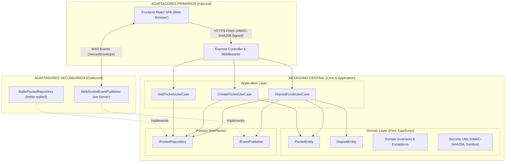
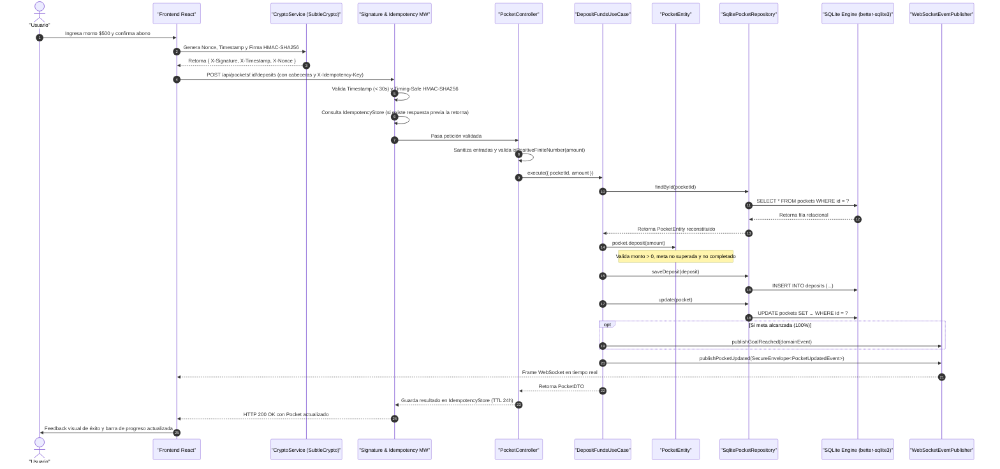

# Documento de Arquitectura de Software: Sistema de Bolsillos de Ahorro Programado

Este documento presenta la justificación técnica, patrones de diseño, principios de ingeniería y tácticas de calidad implementadas en el sistema, diseñado para su revisión por parte de un Arquitecto de Software o Comité Técnico de Arquitectura.

---

## 1. Visión General del Sistema y Contexto del Negocio

### 1.1. Propósito y Alcance
El sistema resuelve la gestión en tiempo real de **Bolsillos de Ahorro Programado (Pockets)**. Permite a los usuarios definir metas financieras, registrar abonos transaccionales garantizando consistencia financiera y recibir actualizaciones reactivas inmediatas cuando se producen abonos o se completa la meta.

### 1.2. Requerimientos Críticos
* **Consistencia e Integridad Financiera:** Imposibilidad de estados corruptos (saldo negativo, exceder la meta fijada, realizar abonos a bolsillos completados o abonos duplicados por fallas de red).
* **Seguridad y Tríada CIA:** Integridad de mensajes, no repudio, mitigación de ataques de repetición (*replay attacks*), sanitización perimetral y mitigación de DoS/OOM.
* **Reactividad en Tiempo Real:** Notificación y sincronización de estado cliente-servidor sin sobrecarga de sondeo (*polling*).
* **Persistencia Relacional Transaccional:** Base de datos SQLite embebida de alto rendimiento con claves foráneas, índices y soporte para WAL.
* **Testabilidad Extrema:** Separación completa entre lógica de negocio y detalles de infraestructura/transporte para permitir pruebas unitarias e integración con 100% de cobertura determinista.

---

## 2. Estilo Arquitectónico y Estructura del Monorepo

### 2.1. Arquitectura Seleccionada
Se ha implementado una **Arquitectura Hexagonal (Ports & Adapters / Clean Architecture)** organizada en un **Monorepo Modular en TypeScript** (NPM Workspaces).

```
examen-fullstack/
├── packages/
│   └── shared/   --> [Fuente Canónica de Contratos]: Modelos, DTOs y eventos WS compartidos entre front y back
└── apps/
    ├── backend/  --> [Dominio, Aplicación e Infraestructura]:
    │                 ├── domain/        --> [Núcleo de Dominio Puro]: Entidades, invariantes, excepciones y utilidades criptográficas
    │                 ├── application/   --> Casos de uso (CreatePocket, DepositFunds, GetPockets)
    │                 ├── ports/         --> Contratos de repositorios y publicadores
    │                 └── infra/         --> Express, Middlewares, WebSockets y persistencia SQLite (better-sqlite3)
    └── frontend/ --> [Presentación SPA]: React 18, Vite, Custom Hooks y Web Crypto API
```

### 2.2. Justificación Técnica y de Negocio
1. **Aislamiento de Reglas de Negocio:** El dominio financiero en `apps/backend/src/domain` no posee dependencias de frameworks (ni Express, ni React, ni librerías de bases de datos). Esto blinda el valor central del negocio frente a la obsolescencia tecnológica.
2. **Monorepo Modular con Capa Compartida de Contratos:** 
   - En `packages/` se aloja única y exclusivamente `@examen-fullstack/shared`, que contiene los contratos canónicos (modelos, DTOs, definiciones de eventos de WebSocket y respuestas tipadas de API). Al mantener solo los contratos en lo compartido, el frontend y el backend comparten un protocolo estricto sin arrastrar lógica de backend ni dependencias innecesarias al cliente.
   - Se garantiza una **Única Fuente de Verdad (Single Source of Truth)**. Si el backend ajusta un DTO o evento, TypeScript valida inmediatamente el impacto en el frontend en tiempo de compilación (`typecheck`).
   - Evita la desincronización de esquemas entre cliente y servidor sin incurrir en la sobrecarga de despliegue de paquetes privados en NPM.
3. **Hexagonal vs. Monolito Tradicional Acoplado (Capas convencionales):**
   - En una arquitectura MVC tradicional, los servicios se acoplan al ORM o a peticiones HTTP. 
   - En la Arquitectura Hexagonal, el flujo de dependencias apunta siempre hacia el centro (el dominio), permitiendo que la persistencia en SQLite o la comunicación WebSocket sean solo adaptadores secundarios conectables mediante contratos.

---

## 3. Principios de Diseño Aplicados (SOLID y DRY)

### 3.1. Principios SOLID

| Principio | Aplicación en el Proyecto | Archivos de Referencia |
| :--- | :--- | :--- |
| **S - Single Responsibility** | Cada caso de uso ejecuta una única operación de negocio (`CreatePocketUseCase`, `DepositFundsUseCase`, `GetPocketsUseCase`). Los controladores solo traducen HTTP y no albergan lógica financiera. La entidad `PocketEntity` solo vela por la consistencia de su estado interno. | [deposit-funds.use-case.ts](file:///home/ubuntu/repos/examen-fullstack/apps/backend/src/application/use-cases/deposit-funds.use-case.ts)<br>[pocket.entity.ts](file:///home/ubuntu/repos/examen-fullstack/apps/backend/src/domain/entities/pocket.entity.ts) |
| **O - Open/Closed** | El sistema está abierto a la extensión y cerrado a la modificación. Nuevos mecanismos de almacenamiento o notificación se agregan creando nuevos adaptadores que cumplan los puertos, sin modificar los casos de uso. | [ports/](file:///home/ubuntu/repos/examen-fullstack/apps/backend/src/ports) |
| **L - Liskov Substitution** | La implementación de `IPocketRepository` ([SqlitePocketRepository](file:///home/ubuntu/repos/examen-fullstack/apps/backend/src/infra/persistence/sqlite/sqlite-pocket.repository.ts)) satisface cabalmente el contrato del puerto y puede ser sustituida por cualquier otro adaptador SQL o NoSQL sin alterar la corrección funcional del caso de uso. | [pocket-repository.port.ts](file:///home/ubuntu/repos/examen-fullstack/apps/backend/src/ports/pocket-repository.port.ts)<br>[sqlite-pocket.repository.ts](file:///home/ubuntu/repos/examen-fullstack/apps/backend/src/infra/persistence/sqlite/sqlite-pocket.repository.ts) |
| **I - Interface Segregation** | Los puertos son pequeños, granulares y altamente cohesivos (`IPocketRepository` para persistencia, `IEventPublisher` para tiempo real), evitando interfaces monolíticas y sobrecargadas. | [event-publisher.port.ts](file:///home/ubuntu/repos/examen-fullstack/apps/backend/src/ports/event-publisher.port.ts) |
| **D - Dependency Inversion** | Las capas de alto nivel (Casos de Uso) no dependen de las capas de bajo nivel (Express, WS, SQLite); ambas dependen de abstracciones (Puertos). La resolución de dependencias ocurre en el *Composition Root*. | [server.ts](file:///home/ubuntu/repos/examen-fullstack/apps/backend/src/infra/server.ts) |

### 3.2. Principio DRY (Don't Repeat Yourself)
* **Contratos Canónicos:** Los modelos (`Pocket`, `Deposit`), DTOs (`CreatePocketDTO`, `CreateDepositDTO`) y sobres de eventos (`SecureEnvelope<T>`) están centralizados en `@examen-fullstack/shared`. Ni el backend ni el frontend redeclaran estructuras ni tipos repetidos.
* **Dominio Compartido de Formateo:** Funciones de transformación de moneda y cálculo de porcentajes están modularizadas para su uso en toda la interfaz sin duplicidad.

---

## 4. Catálogo de Patrones de Diseño Implementados

### 4.1. Patrones en el Backend
1. **Repository Pattern:** Abstrae el acceso a la colección de bolsillos y depósitos (`IPocketRepository`) mediante [SqlitePocketRepository](file:///home/ubuntu/repos/examen-fullstack/apps/backend/src/infra/persistence/sqlite/sqlite-pocket.repository.ts), aislando el motor de persistencia relacional y sentencias SQL preparadas.
2. **Dependency Injection (DI) & Composition Root:** Ensamblado explícito en [server.ts](file:///home/ubuntu/repos/examen-fullstack/apps/backend/src/infra/server.ts) de adaptadores hacia los casos de uso mediante constructor, permitiendo sustitución trivial por dobles de prueba (*mocks/stubs*).
3. **Factory Method & Reconstitution:** 
   - `PocketEntity.create()`: Valida invariantes iniciales y genera valores por defecto para nuevos bolsillos.
   - `PocketEntity.reconstitute()`: Rehidrata entidades recuperadas desde las filas de SQLite sin revalidar reglas exclusivas de creación.
4. **Observer / Publish-Subscribe:** Emisión desacoplada de eventos de dominio (`GoalReachedDomainEvent`) y eventos reactivos hacia clientes vía WebSocket (`WebSocketEventPublisher`).
5. **Interceptor / Middleware (Chain of Responsibility):** Tubería secuencial en Express:
   - *SignatureMiddleware:* Valida integridad criptográfica HMAC-SHA256 y timestamp anti-replay.
   - *IdempotencyMiddleware:* Intercepta cabecera `X-Idempotency-Key` y recupera respuestas cacheadas.
   - *Controller:* Valida esquemas y orquesta con la aplicación.
   - *ErrorMiddleware:* Filtra y traduce excepciones de dominio a códigos HTTP semánticos (400, 401, 404, 422).
6. **Idempotent Consumer / Cache-Aside:** Garantiza ejecución una única vez (*exactly-once semantics* aparente en capa de transporte) para transacciones de abono.
7. **Timing-Safe Hash Comparator:** Uso de `crypto.timingSafeEqual` en la verificación HMAC-SHA256 para prevenir ataques de canal lateral por análisis de tiempo (*Timing Attacks*).

### 4.2. Patrones en el Frontend
1. **Component-Driven Architecture:** Componentes presentacionales desacoplados (`PocketCard`, `GoalCelebration`, `DepositModal`, `CreatePocketModal`).
2. **Custom Hooks Pattern:** Encapsulación de lógica asíncrona y reactiva (`usePockets`, `useDeposit`), separando la vista del ciclo de vida y los servicios.
3. **Service Layer:** Abstracción unificada del cliente HTTP (`api.service.ts`), WebSocket (`websocket.service.ts`) y criptografía nativa (`crypto.service.ts`).
4. **Web Crypto Provider:** Integración con la API estándar del navegador (`window.crypto.subtle`) para cálculo de firmas digitales sin librerías pesadas de terceros.

---

## 5. Diagramas Arquitectónicos

### 5.1. Diagrama Hexagonal y Límites de Módulos



### 5.2. Diagrama de Secuencia: Flujo de un Abono Seguro (End-to-End)



---

## 6. Estrategia de Datos, Consistencia y Persistencia

### 6.1. Modelo Entidad-Relación y Esquema Relacional

```
┌─────────────────────────┐           1..* ┌─────────────────────────┐
│         pockets         │────────────────│        deposits         │
├─────────────────────────┤                ├─────────────────────────┤
│ id: TEXT (PK)           │                │ id: TEXT (PK)           │
│ name: TEXT              │                │ pocket_id: TEXT (FK)    │
│ target_amount: REAL     │                │ amount: REAL            │
│ current_amount: REAL    │                │ created_at: TEXT        │
│ progress: REAL          │                └─────────────────────────┘
│ is_completed: INTEGER   │
│ created_at: TEXT        │
└─────────────────────────┘
```

### 6.2. Motor y Configuración de Persistencia
* **Motor Seleccionado:** **SQLite** a través de la librería `better-sqlite3`, que ofrece un motor nativo C++ precompilado de altísimo rendimiento y ejecución síncrona sin sobrecarga de hilos.
* **Integridad Referencial:** Se aplica `PRAGMA foreign_keys = ON;` garantizando que no puedan crearse abonos huérfanos y que la eliminación de un bolsillo elimine sus abonos asociados en cascada (`ON DELETE CASCADE`).
* **Concurrencia y Resiliencia:** Se configura `PRAGMA journal_mode = WAL;` (Write-Ahead Logging), permitiendo lecturas concurrentes sin bloquear escrituras.
* **Optimización de Consultas:** Se implementa un índice explícito `idx_deposits_pocket_id` sobre la clave foránea `pocket_id` para acelerar consultas de histórico de depósitos.
* **Sentencias Preparadas (Prepared Statements):** [SqlitePocketRepository](file:///home/ubuntu/repos/examen-fullstack/apps/backend/src/infra/persistence/sqlite/sqlite-pocket.repository.ts) precompila todas las operaciones SQL en su inicialización, previniendo cualquier tipo de inyección SQL y optimizando el ciclo de ejecución.
* **Ubicación del Archivo de Base de Datos:**
  - En entorno de ejecución y producción: `process.env.DATABASE_PATH || './data/pockets.db'`, persistiendo en disco de forma segura.
  - En pruebas automatizadas: `:memory:`, permitiendo ejecución en memoria atómica, aislada y sin contención entre suites de prueba.

---

## 7. Seguridad Integral y Tácticas de Arquitectura (Tríada CIA)

El sistema implementa el catálogo formal de **Tácticas de Arquitectura del Software Engineering Institute (SEI)** (Bass, Clements, Kazman) para satisfacer los atributos de calidad de seguridad y disponibilidad:

### 7.1. Matriz de la Tríada CIA

```
                             LA TRÍADA CIA
    ┌──────────────────────────────┬──────────────────────────────┐
    │       CONFIDENCIALIDAD       │          INTEGRIDAD          │
    │  - Desactivar X-Powered-By   │  - HMAC-SHA256 (Anti-Tamper) │
    │  - Headers nosniff / DENY    │  - Anti-Replay (Timestamp)   │
    │  - Sanitización de errores   │  - Sanitización XSS / HTML   │
    │    sin fugas de stack trace  │  - Validación estricta > 0   │
    │                              │  - Idempotencia (Sin cobro x2)│
    │                              │  - Claves Foráneas en SQLite │
    └──────────────────────────────┴──────────────────────────────┘
                                   │
                                   ▼
                            DISPONIBILIDAD
             - IdempotencyStore con TTL (24h) y LRU (Anti-OOM)
             - Payload Limit estricto a 10kb (Anti-DoS)
             - Heartbeat ping/pong 30s en WebSocket (Anti-Leaking)
             - Contención de errores centralizada
             - Modo WAL en SQLite para lecturas no bloqueantes
```

### 7.2. Tácticas de Seguridad (Security Tactics)

#### A. Detectar Ataques (Detect Attacks)
* **Verificación Criptográfica en Tiempo Constante:** [security.utils.ts](file:///home/ubuntu/repos/examen-fullstack/apps/backend/src/domain/security/security.utils.ts) implementa `timingSafeEqual` en `verifyHmacSha256`, neutralizando ataques de temporización orientados a deducir firmas.
* **Detección de Ataques de Repetición (*Message Freshness*):** [signature.middleware.ts](file:///home/ubuntu/repos/examen-fullstack/apps/backend/src/infra/http/middlewares/signature.middleware.ts) compara el `X-Timestamp` contra una ventana de tolerancia de 30 segundos, descartando peticiones interceptadas y reenviadas.

#### B. Resistir Ataques (Resist Attacks)
* **Autenticidad e Integridad de Mensajes:** Firma HMAC-SHA256 en cabeceras HTTP (`X-Signature`) y en sobres de WebSocket (`SecureEnvelope`), garantizando que la carga no fue alterada en tránsito (*Anti-Tampering*).
* **Sanitización Perimetral de Entradas:** [sanitizeString](file:///home/ubuntu/repos/examen-fullstack/apps/backend/src/domain/security/security.utils.ts) neutraliza etiquetas HTML (`<script>`, ``, etc.) y caracteres de control invisibles en nombres de bolsillo antes de almacenarlos.
* **Validación Estricta de Límites en Backend:** [isPositiveFiniteNumber](file:///home/ubuntu/repos/examen-fullstack/apps/backend/src/domain/security/security.utils.ts) asegura en el servidor que montos de creación y abonos sean estrictamente mayores a cero, finitos y no `NaN`/`Infinity`.
* **Reducción de Superficie de Exposición:** `app.disable('x-powered-by')` y cabeceras `X-Content-Type-Options: nosniff` y `X-Frame-Options: DENY` en [app.ts](file:///home/ubuntu/repos/examen-fullstack/apps/backend/src/infra/http/app.ts).
* **Integridad Transaccional:** Middleware de idempotencia mediante `X-Idempotency-Key` en [idempotency.middleware.ts](file:///home/ubuntu/repos/examen-fullstack/apps/backend/src/infra/http/middlewares/idempotency.middleware.ts) para evitar duplicación de abonos.

### 7.3. Tácticas de Disponibilidad (Availability Tactics)

#### A. Prevención de Fallas (Fault Prevention)
* **Gestión de Recursos y Expiración en Caché (Anti-OOM DoS):** [IdempotencyStore](file:///home/ubuntu/repos/examen-fullstack/apps/backend/src/infra/http/middlewares/idempotency.middleware.ts) implementa TTL de 24 horas, límite máximo de 10,000 entradas con expulsión FIFO/LRU y método `pruneExpired()` para eliminar cualquier riesgo de fuga de memoria.
* **Restricción de Tamaño de Carga Útil:** Configuración de `express.json({ limit: '10kb' })` en [app.ts](file:///home/ubuntu/repos/examen-fullstack/apps/backend/src/infra/http/app.ts) para prevenir agotamiento de buffer por *Payload Bombing*.
* **Persistencia Robusta:** SQLite con modo WAL evita bloqueos de base de datos durante escrituras simultáneas.

#### B. Detección y Saneamiento de Fallas (Fault Detection & Health Monitoring)
* **Heartbeat de Conexiones:** En [websocket.event-publisher.ts](file:///home/ubuntu/repos/examen-fullstack/apps/backend/src/infra/realtime/websocket.event-publisher.ts), un temporizador desreferenciado (`unref()`) ejecuta `ping`/`pong` cada 30 segundos, ejecutando `.terminate()` sobre clientes zombies para liberar descriptores de archivo y puertos de red.

#### C. Contención y Recuperación de Fallas (Fault Recovery)
* **Manejo Centralizado de Excepciones:** [error.middleware.ts](file:///home/ubuntu/repos/examen-fullstack/apps/backend/src/infra/http/middlewares/error.middleware.ts) captura excepciones de dominio y fallos de infraestructura, impidiendo que errores no capturados ocasionen la caída abrupta (*crash*) del proceso Node.js.

---

## 8. Verificación de Calidad y Estado de Pruebas

El sistema cuenta con una estrategia integral de pruebas automatizadas basada en TDD:
* **Cobertura Total:** 12 suites de prueba pasadas, 67 pruebas unitarias y de integración al 100% verde (`npm test`).
* **Verificación de Tipos Estricta:** 0 errores en compilador TypeScript (`npm run typecheck`).
* **Compilación de Producción:** Paquete estático optimizado con Vite (`npm run build`) listo para despliegue.
